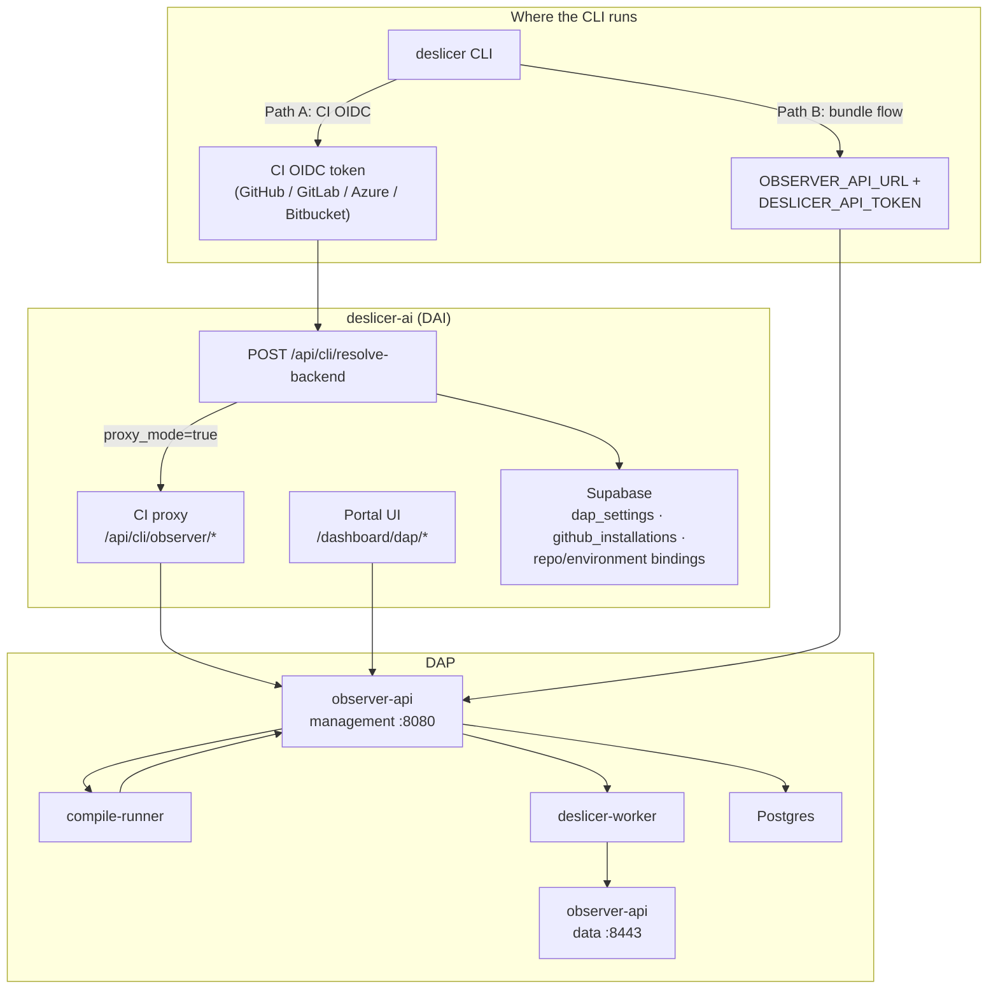
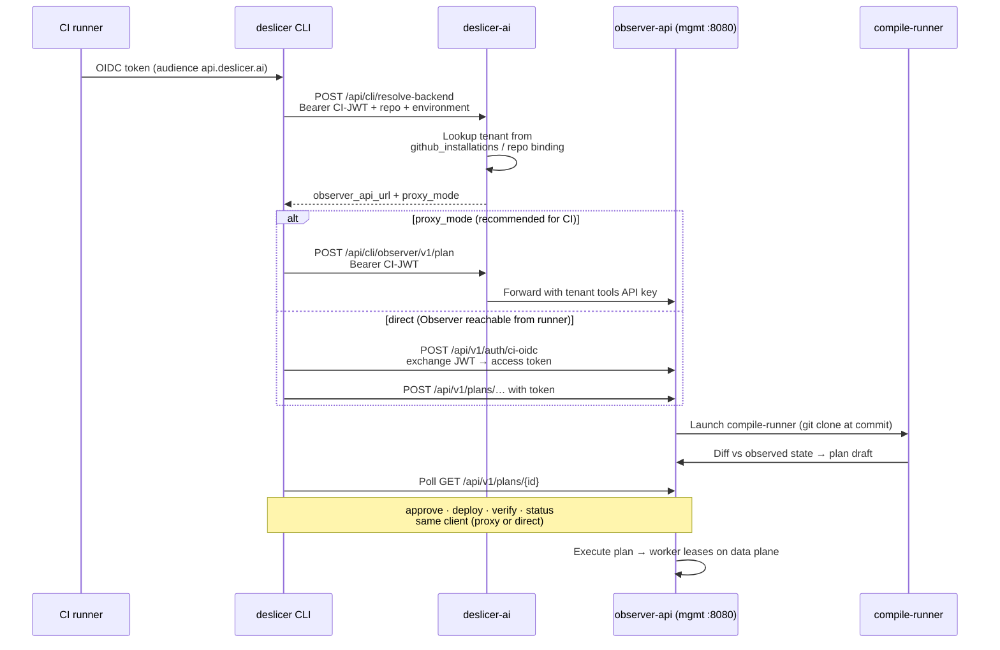
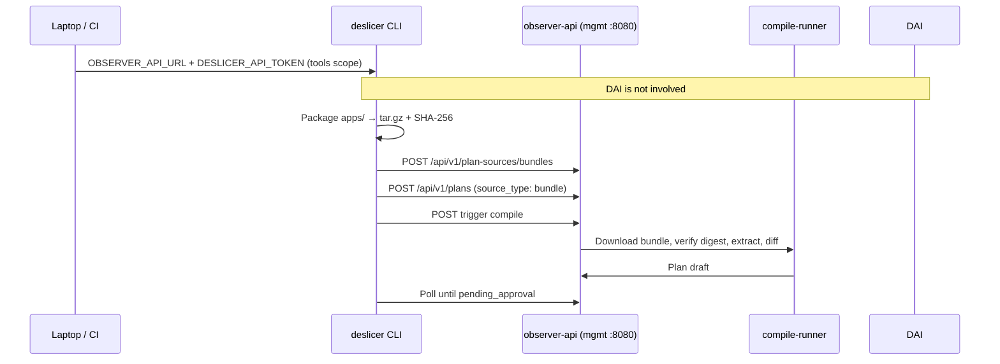
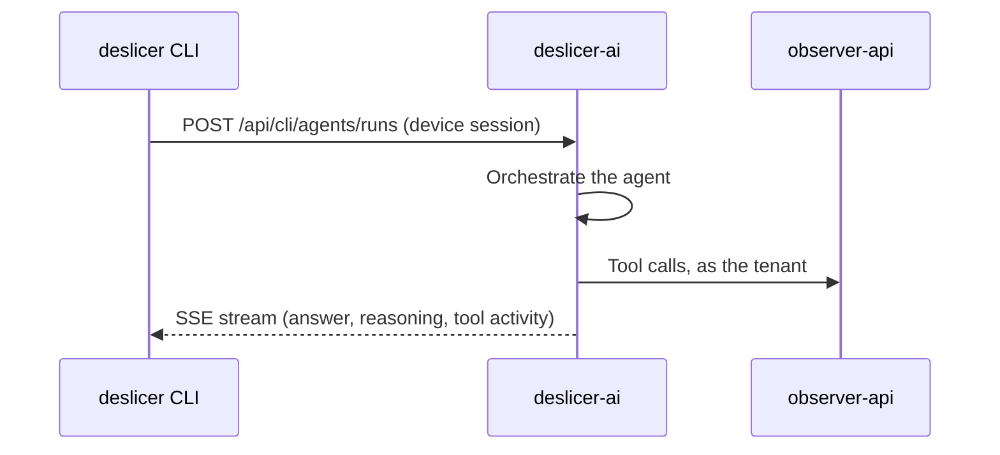
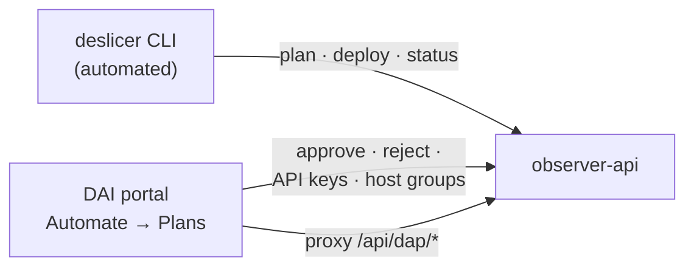

# Architecture — CLI, DAP, and deslicer-ai

How the `deslicer` CLI integrates with **deslicer-ai (DAI)** — the portal and CI control plane — and **DAP (Deslicer Automation Platform)** — the Observer API, compile-runner, and worker execution stack.

For hands-on steps, see [quickstart.md](quickstart.md) (Path A: CI OIDC, Path B: bundle upload).

## Components

| Component | Repo / service | Role |
|-----------|----------------|------|
| **deslicer CLI** | [deslicer/cli](https://github.com/deslicer/cli) | CI/laptop client for plan lifecycle |
| **deslicer-ai (DAI)** | deslicer-ai | Portal UI, tenant settings, CI proxy, `resolve-backend` |
| **observer-api** | DAP | Management plane (:8080) — plans, groups, compile, approve; data plane (:8443) — ingest, workers |
| **compile-runner** | DAP | Ephemeral Docker job — git clone or bundle extract, diff, post draft |
| **deslicer-worker** | DAP | On-prem Splunk host agent — executes approved plans (HTTPS to data plane) |

The CLI never talks to workers or NATS directly. Execution is always Observer-scheduled after a human-approved plan.

## High-level overview

## Three integration paths

Paths A and B are two ways to get a change plan compiled; they differ in
**auth**, **whether DAI is involved**, and **how source code reaches the
compile-runner**. Path C is a different job entirely — asking an agent a
question — and shares none of that machinery.

| | **Path A — CI / OIDC** | **Path B — Bundle upload** | **Path C — Agent run** |
|---|---|---|---|
| **Trigger** | `deslicer change plan` (default) | `deslicer change plan --source-dir …` | `deslicer agent run` |
| **Auth** | CI OIDC JWT (audience `https://api.deslicer.ai`) | Static `DESLICER_API_TOKEN` (`tools` scope) | Device session (`deslicer login`) |
| **DAI involved?** | Yes — resolve-backend; usually CI proxy | No — direct to Observer | Yes — DAI runs the agent |
| **Source** | Git clone at CI commit | Local `apps/` directory (tar.gz + SHA-256) | A prompt |
| **GitHub App** | Repo bound in DAI (`github_installations`) | Not required | Not required |
| **Trust tier** | Can be git-verified (`is_trusted_source`) | Always `is_trusted_source: false`, `source_tier: ci_bundle` | n/a — no plan is produced |
| **Best for** | Production CI pipelines | Local eval, air-gap, unsupported CI OIDC | Asking a fleet question from a terminal |
| **Docs** | [quickstart.md § Path A](quickstart.md#path-a-ci-pipeline-with-oidc) | [bundle-flow.md](bundle-flow.md) | [agent-runs.md](agent-runs.md) |

---

## Path A — CI pipeline (resolve-then-direct via DAI)

Default mode for `deslicer change plan` without `--source-dir`.

### Sequence

### Resolve-then-direct

1. **Resolve** — `POST /api/cli/resolve-backend` on deslicer-ai maps `repo + environment` → tenant → Observer URL. Implemented in `src/resolver.rs`.
2. **Direct** — after resolve, the CLI talks to Observer (or the DAI CI proxy fronting Observer) for all plan operations. OIDC audience is always `https://api.deslicer.ai`.

If `OBSERVER_API_URL` is set, resolve is skipped (`resolution_path: observer_url_override`). The git-orchestrated `change plan` path still requires CI proxy mode unless your runner can reach Observer management directly.

### Proxy mode vs direct exchange

| Mode | `resolve-backend` returns | CLI auth to Observer |
|------|---------------------------|----------------------|
| **Proxy** (`CI_PROXY_MODE`) | `https://api.deslicer.ai/api/cli/observer/` | CI JWT on every request; DAI forwards with tenant API key |
| **Direct** | Raw Observer mgmt URL | One-time `POST /api/v1/auth/ci-oidc` → short-lived access token |

Proxy mode is recommended for CI: runners never hold a long-lived Observer API key. See `src/commands/pipeline.rs`.

### What DAI owns

| Piece | Role |
|-------|------|
| `resolve-backend` | Maps repo/environment → tenant → Observer URL |
| CI proxy (`/api/cli/observer/*`) | Validates CI JWT, forwards to Observer mgmt plane |
| `dap_settings` | Per-tenant Observer URL + encrypted API keys |
| `github_installations` / `github_repos` | Binds a GitHub repo to a tenant |
| Portal `/api/dap/*` | Browser UI proxy to Observer (separate from CLI, same backend) |

### What DAP owns

| Piece | Role |
|-------|------|
| observer-api mgmt (:8080) | Plan CRUD, compile trigger, approval, execution control |
| compile-runner | Clones git repo, diffs against observed state, posts draft |
| worker-node | Runs approved plans on Splunk hosts (data plane :8443) |

---

## Path B — Bundle upload (GitHub-App-free, no DAI)

`deslicer change plan --source-dir <dir> --target-group <uuid>`. Skips deslicer-ai entirely.

### Sequence

Steps map to `src/commands/change/plan.rs` (`run_bundle_flow`) and `src/bundle.rs`. Full detail: [bundle-flow.md](bundle-flow.md).

**Security:** digest verified at upload and again by compile-runner; bundle plans never receive git-verified trust (REQ-SIGN-008). Approval still requires a verified human in the portal.

---

## Path C — Agent runs (DAI only)

`deslicer agent` is the one command group that never reaches Observer. The CLI
posts to deslicer-ai at `/api/cli/agents/runs` and reads the answer back as a
Server-Sent Events stream; whatever Observer calls the agent makes on the way
are the agent's own, made server-side with the tenant's stored credentials.

Two properties follow from the run living in DAI rather than in the CLI
process:

- **The run outlives the connection.** Ctrl-C, a dropped network, or a closed
  laptop stops the reading, not the run. `deslicer agent logs <run-id>
  --follow` reattaches to a live stream when the deployment has Redis, and
  falls back to polling the stored transcript when it does not.
- **Auth is a person, not a pipeline.** Agent runs need a device session; a CI
  OIDC token has no principal whose team and tool permissions the orchestrator
  could resolve.

Steps map to `src/commands/agent/` in this repo and
`lib/integrations/cli-device/agent-run/` in deslicer-ai. Full detail:
[agent-runs.md](agent-runs.md).

---

## Human approval boundary

The CLI can create plans and trigger deploy/verify, but **approval** requires verified human identity — portal session, platform MFA, or (in CI) a GitHub Environment with required reviewers so the proxy can attest the approver. A raw `tools`-scope API key cannot self-approve.

---

## Observer API planes

| Plane | Port (typical) | CLI usage |
|-------|----------------|-----------|
| **Management** | 8080 (8088 via compose publish) | All CLI plan/bundle/compile routes |
| **Data** | 8443 | Not used by CLI (workers, insights ingest, bootstrap) |

Set `OBSERVER_API_URL` to the **management** plane URL. Using the data plane port returns wrong responses or connection errors.

---

## Local development map

| Goal | Path | Setup |
|------|------|--------|
| Fastest smoke test | B (bundle) | DAP stack + `SEED_API_KEY` + `OBSERVER_API_URL=http://localhost:8080` — [local-testing.md](local-testing.md) |
| Full CI proxy path | A (OIDC) | DAP + DAI + seed `github_installations`, `dap_settings`, repo bindings + OIDC or `DESLICER_DEV_TOKEN` |
| Portal-only | — | DAI → `/api/dap/*` → Observer; no CLI required for browse/approve |

---

## Code map (CLI repo)

| Module | Responsibility |
|--------|----------------|
| `src/resolver.rs` | `POST /api/cli/resolve-backend` |
| `src/oidc_exchange.rs` | `POST /api/v1/auth/ci-oidc` (non-proxy mode) |
| `src/commands/pipeline.rs` | Authenticate: resolve + build `Client` |
| `src/observer_client/` | HTTP to Observer or CI proxy (`/api/cli/observer/…`) |
| `src/commands/change/plan.rs` | Orchestrated plan (Path A) vs bundle flow (Path B) |
| `src/bundle.rs` | Deterministic tar.gz packaging |
| `src/commands/agent/` | Agent runs (Path C): HTTP client, stream consumer, renderer |
| `src/sse.rs` | Incremental Server-Sent Events parser |
